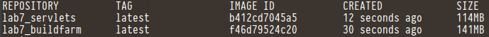
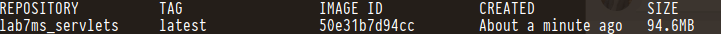

**README**

- Образы на основе alpine:latest
- Используется файл .env c _COMPOSE_PROJECT_NAME_
- war-файл разворчивается в корне рабочего каталога tomcat
- В каталоге multi-stage_builds - cборка c использованием multi-stage, Dockerfile один, контейнер один.   

**Размеры образов**

- Обычный режим с созданием 2 контейнеров

- multi-stage builds

